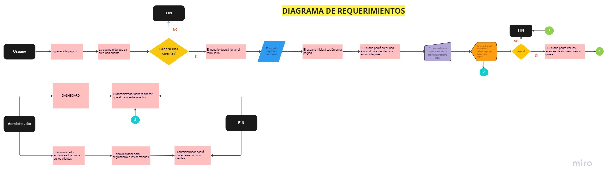
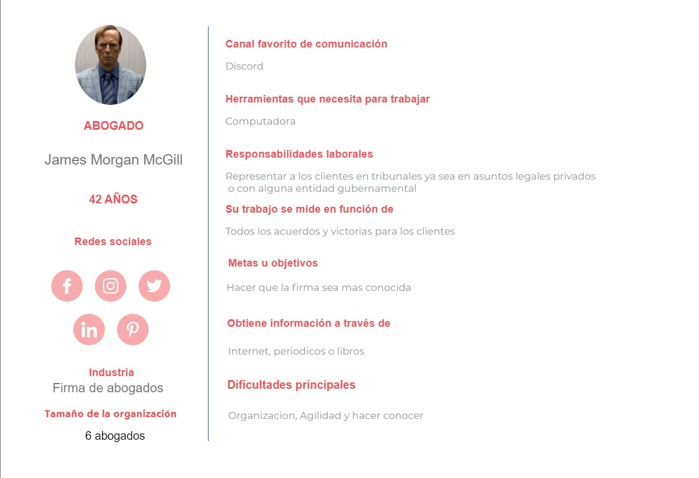
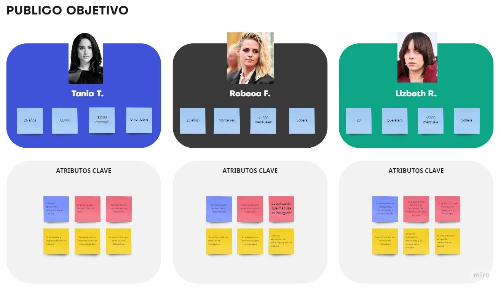
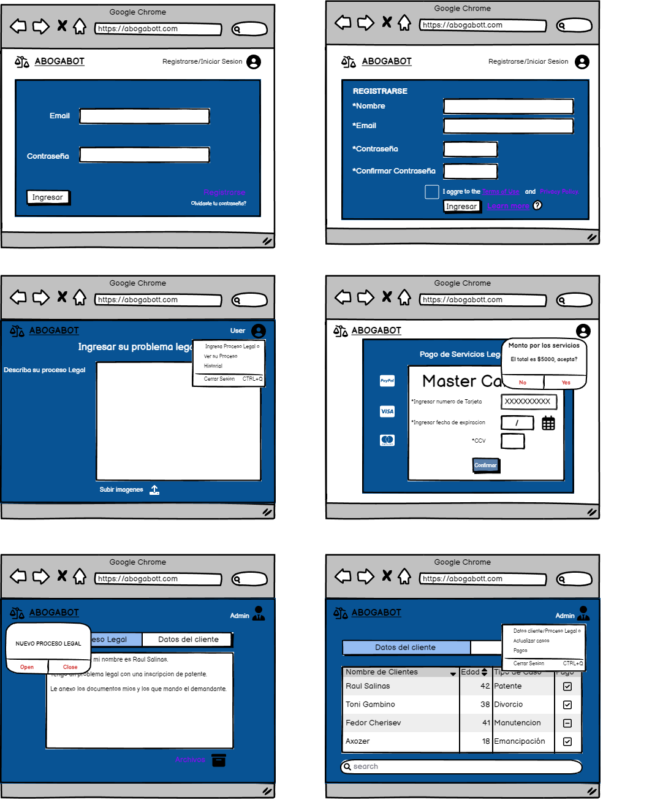

# ABOGABOT
-----------------------------------------------------------------------------------------------------------------------------------

## Toma de Requerimientos

* **SOLICITANTE**

Solicita una pagina web en la cual el cliente pueda crear su cuenta y ver el seguimiento de las actualizaciones de los procesos legales de cada cliente y que se pueda recibir notificaciones cada vez que haya avances en sus casos mediante correo. Ademas que se le mandara una notificacion sobre el precio por los servicios, donde si acepta, se le pedira que llene un formulario para que pueda  ingresar los datos de su tarjeta o pagar por medio de Paypal.

 haya un nuevo cliente, nuevo proceso legal y cada que el cliente pague.

 * **ADMINISTRADOR**

El administrador del sitio debe recibir notificaciones de cada nuevo proceso legal y con le formulario lleno, debe automáticamente crearse un documento legal en formato word asi como poder recibir las imagenes que anexen los demandantes.

Asi mismo el administrador podra ver los pagos efectuados y los que no se hiciero, ademas de que podra actualizar los procesos de las demandas, agregar notas y subir evidencias en cada paso de la demanda.

---------------------------------------------------------------------------------------------------------------

## Flujo de Trabajo

----------------------------------------------------------------------------------------------------

## Buyer Persona

------------------------------------------------------------------------------------------------------------------------

## Publico Objetivo

----------------------------------------------------------------------------------------------------------------------

## UX/UI

------------------------------------------------------------------------------------------------------------------------
